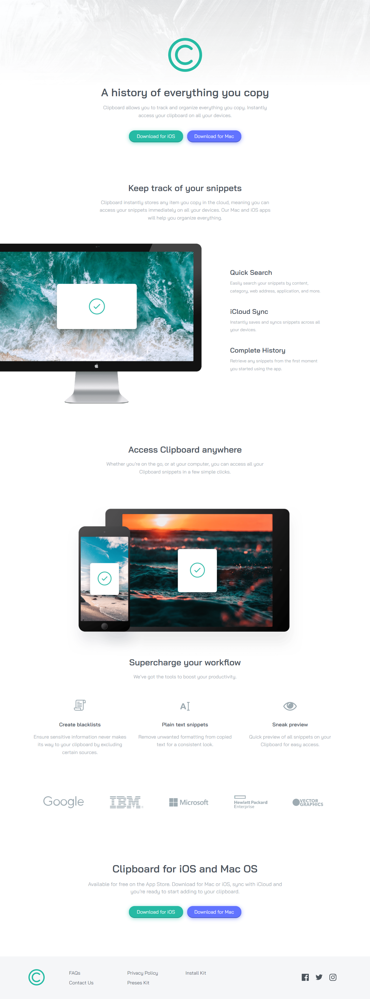

# Clipboard Landing-page
Frontend Mentor Challenge - Clipboard landing page

  

## Sobre o projeto:
Projeto criado através do desafio do Frontend Mentor com a finalidade de compartilhar conhecimentos em grupo ou dupla. A proposta é da comunidade [Desbravando  a programação](https://discord.gg/jeYD43z7), para que possamos criar projetos juntos e aprimorar nossas habilidades.

🎯 [🔗 Acessar desafio](https://www.frontendmentor.io/challenges/clipboard-landing-page-5cc9bccd6c4c91111378ecb9) 
🌐 [🔗 Acessar projeto](https://clipboardlp-project.vercel.app/)

## 🛠 Tecnologias:
- HTML
- CSS
- JavaScript
- React.js
- Vite

## 👥 Autores
- [@CauanDZN](https://github.com/CauanDZN)
- [@AndersonRodrigs](https://github.com/AndersonRodrigs)
